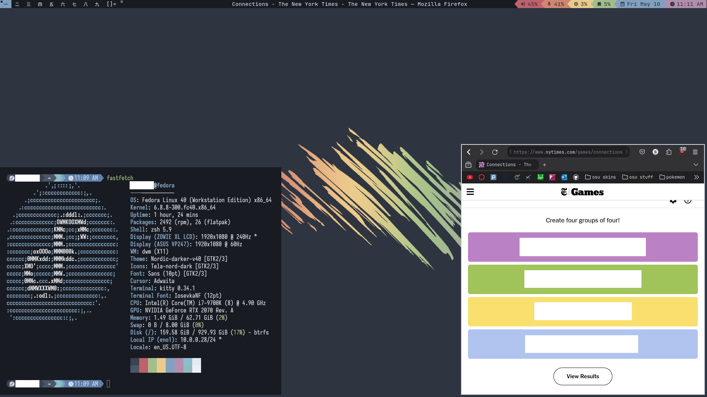

# My Fedora + DWM Rice

### Screenshots


---
### Dependencies
- zsh
    - starship
    - zsh-autosuggestions
    - zsh-syntax-highlighting
- kitty
- dunst
- neovim
- JetBrainsMono Nerd Font
- Iosevka Nerd Font

### Installation
**WARNING:** If you're reading this, that means I'm in the brief period between writing the install.sh script and actually running it. This might actually ruin your entire computer. Be warned.

Execute the following commands:
```sh
cd ~  # Change to your home directory
git clone https://github.com/clarks03/dwm-dotfiles.git
cd dwm-dotfiles.git
chmod +x install.sh
./install.sh
```

And follow along with the prompts.
